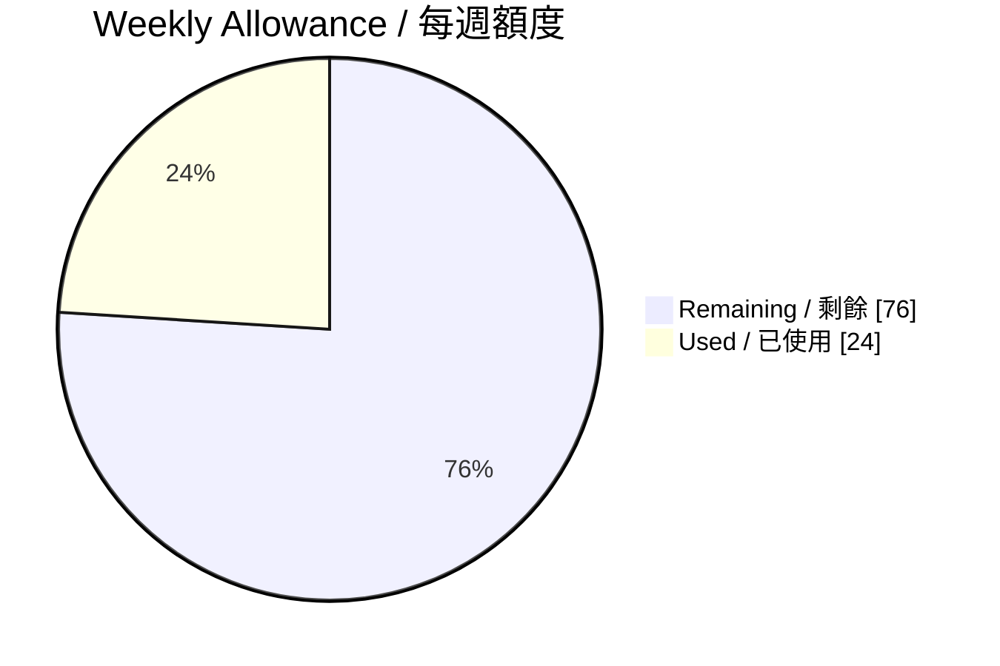

# Visual Report Format / 視覺報告格式

English must appear before Traditional Chinese throughout the report.

## Mandatory opening

Do not place a report title above the reset time. Begin exactly with this hierarchy:

```markdown
## NEXT RESET / 下次重置

# TUE, SEP 22, 2026 · 09:42 GMT+8
```

Use the user's actual localized time, spell out the timezone, and never omit the date.

## Status strip

Immediately below the reset time, render a compact table:

| WEEKLY LEFT / 每週剩餘 | 5-HOUR LEFT / 五小時剩餘 | CREDITS / 點數 | BANKED RESETS / 儲存重置 |
|---:|---:|---:|---:|
| 76% | Not exposed / 未顯示 | 0 | 2 |

Use `Not exposed / 未顯示` for an unavailable account value.

## Allowance chart

Render a Mermaid pie chart showing weekly used versus remaining percentage:



## Burn forecast chart

When the forecast is defensible, render a compact `xychart-beta`. Use elapsed day offsets on the x-axis and remaining allowance on the y-axis. Include at least current remaining, projected exhaustion, and scheduled reset points. Keep labels short and explain exact timestamps beneath the chart.

## Reset timeline

Use a table rather than a wide timeline on mobile:

| EVENT / 事件 | TIME / 時間 | EFFECT / 影響 |
|---|---|---|
| Projected exhaustion / 預估用完 | … | Work may stop / 工作可能中斷 |
| Normal reset / 正常重置 | … | Allowance refresh / 額度恢復 |
| Earliest banked expiry / 最早儲存重置到期 | … | Unused reset expires / 未使用即失效 |

## Recommendation panel

Use exactly one primary status:

- `🟢 CONTINUE / 繼續使用`
- `🟡 SLOW DOWN / 降低消耗`
- `🟠 WAIT FOR RESET / 等待重置`
- `🔴 CONSIDER BANKED RESET / 考慮使用儲存重置`

State the best action first, followed by no more than three reasons. Clearly say `No action was executed / 未執行任何操作`.

## Source labels

Close with three compact source groups:

- `Account facts / 帳號事實`: authenticated Usage page.
- `Official rules and announcements / 官方規則與公告`: link the exact OpenAI Help Center or Release Notes page used.
- `Third-party intelligence / 第三方情報`: link codex-resets.com and mark each item verified or unverified.

Do not merge official and third-party information under one heading. The reader must be able to see the authority level immediately.
